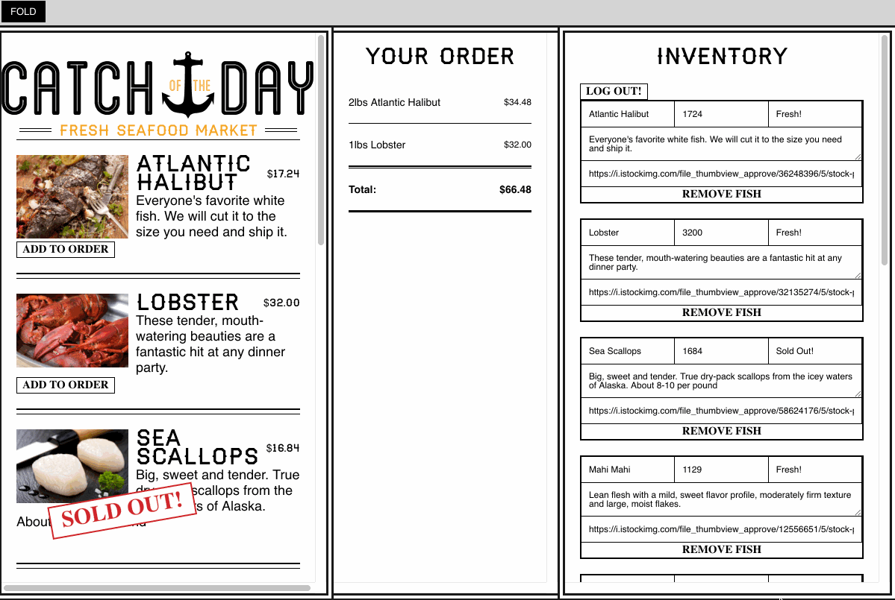
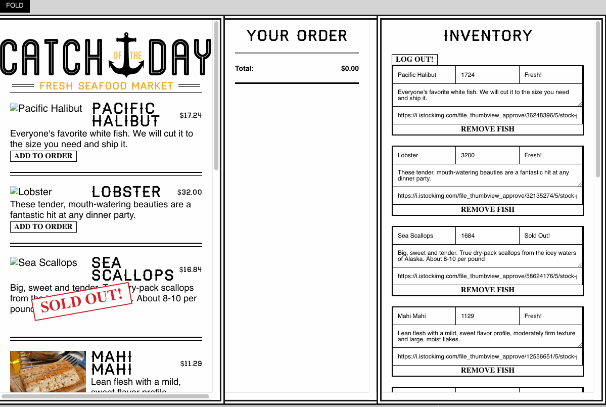

(See screenshots below.)

* The challenge: Create an interactive single-page app for a fish market that would provide an interface for inventory control, 
dynamically updated menu, and real-time ordering.

* The solution: An app built in ReactJS using create-react-app with state.

* Features:
     * Entering the name of a store leads to a display with...
     
     * Separate areas of the page for menu, order, and inventory.
     

     * All areas are connected through state and update dynamically as state changes.
     
     * State can be changed by making changes to any element right on the page.
      

     * When the user clicks on a button to order fish, the order is logged in the order section. 
     (If the same fish is ordered again, the quantity and price of the order change.)
 

     * If the user changes her mind, an item can be removed from the order.

     * If all of one kind of fish is sold, changing the inventory to "sold out" also 
     changes the menu and any open orders.
     
   

     * And just for fun, there is a button to "fold" the menu.
     
       

* Technology:
     * Content is rendered to an HTML page.

     * The structure of the app is provided by create-react-app.
     
     * Content is JSX generated by a series of components, all of which get their data  
     through props passed from state held in the App component.

     * Styling is controlled by separate CSS files.

     * Images are stored with the program files.
     
     * State of the app is held in Firebase using HTML5 websockets in real time so 
     no matter how many people are editing it at once, 
     the data will always be synced to everyone’s computer.
     
     * Instead of using cookies,; ORDER state is held locally in the user's browser 
     (we sync order state to HTML5 local storage.
     
     * The original app was created by Wes Bos. The implementation (including the animated gifs!)is mine.

